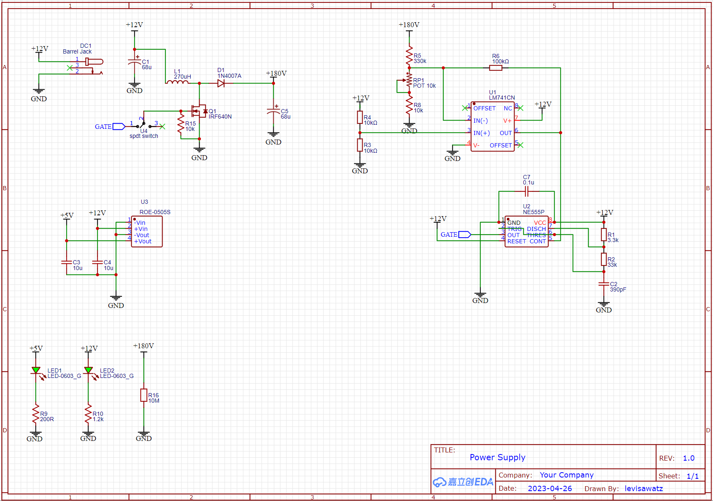
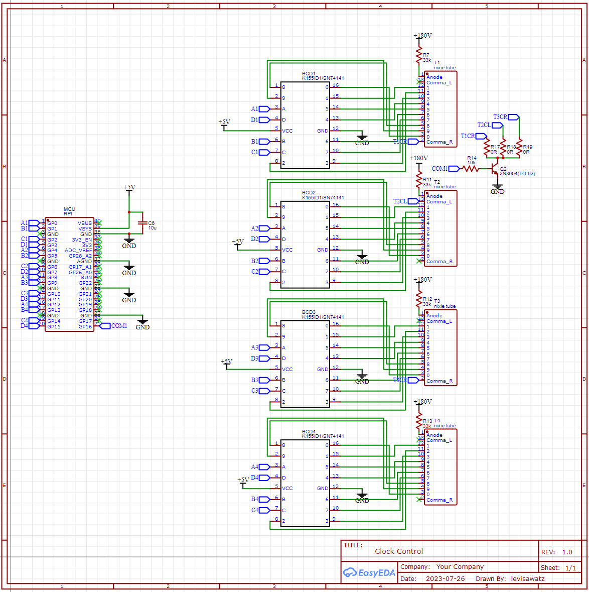

# Nixie_Clock  

  
This is a personal project that I persued because of my interests in power electronics, high voltage circuits and vintge electrical components. It also was an opportunity to gain experience in PCB design.

For the digits, I used Soviet Nixie tubes which require 180V DC to light up.  
To get the required high voltage, I designed a 12V-180V boost converter which uses feedback to achive a constant voltage of 180V regardless of the load.

For the clock control, I used a Raspberry Pi Pico programmed in MicroPython.  

